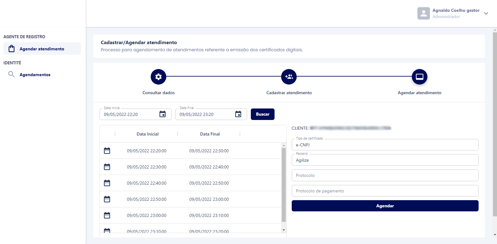

# Sistema de agendas para emissão de certificados digitais

Status: <strong>em andamento</strong>

Este projeto está sendo desenvolvimento a pedido de um cliente. 
Para publica-lo aqui no github eu removi toda a identidade visual da 
aplicação assim como dados que possam violar a marca do cliente 
em questão.

O projeto todo está sendo desenvolvido com arquitetura limpa, ecosistema React e Material UI V5.

## Funcionalidades
- Login
- Controle de roles (agente de registro, agente de vídeo e gestor)
- Listar agendamentos
- Cadastrar agendamentos
- Visualizar detalhes dos agendamentos
- Confirmar agendamentos
- Confirmar video conferência
- Finalizar agendamentos
- Cancelar agendamentos

## Ferramentas utilizadas
    
    - React-redux: https://react-redux.js.org/
    - Redux toolkit: https://redux-toolkit.js.org/
