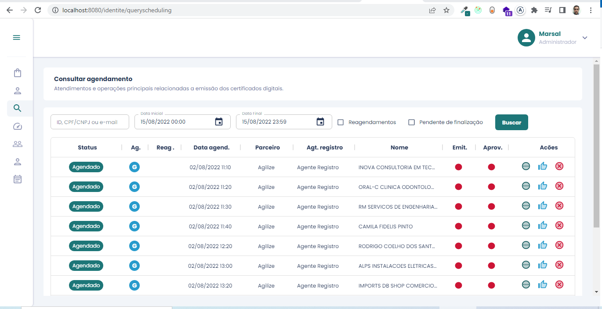

# Sistema de agendas para emissão de certificados digitais

Status: <strong>em andamento</strong>

O projeto todo está sendo desenvolvido com arquitetura limpa dentro do ecossistema React com Typescript utilizando MaterialUI V5 para estilização.

Este projeto está sendo desenvolvimento a pedido de um cliente do ramo. 

## Funcionalidades
- Login
- Controle de roles (agente de registro, agente de vídeo e gestor)
- Consultar agendamentos
- Consultar detalhes dos agendamentos
- Cadastrar agendamentos
- Confirmar agendamentos
- Confirmar video conferência
- Finalizar agendamentos
- Cancelar agendamentos
- Dashboards para acompanhamento
- Manutenção de usuários
- Manutenção de parceiros
- Manutenção de clientes

## Ferramentas utilizadas
    
- React: https://pt-br.reactjs.org/
- MaterialUI v5: https://mui.com/pt/
- React-redux: https://react-redux.js.org/
- Redux toolkit: https://redux-toolkit.js.org/
- Webpack: https://webpack.js.org/

